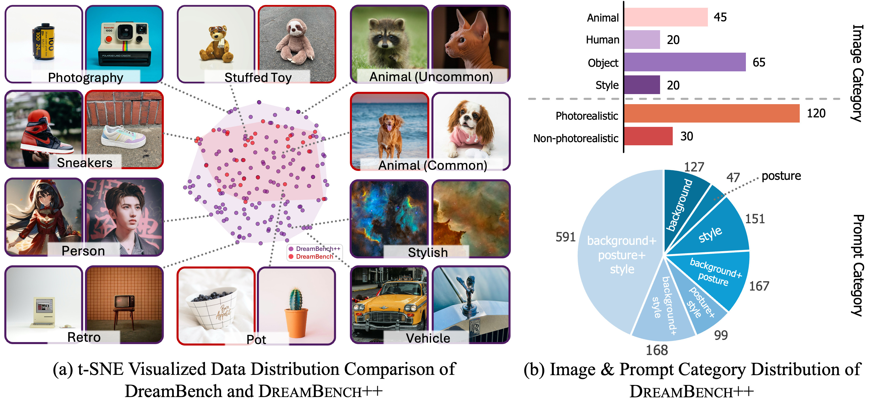

<div align="center">

# <a href="https://dreambenchplus.github.io">DreamBench++</a>

## <a href="https://dreambenchplus.github.io">A Human-Aligned Benchmark for Personalized Image Generation</a>

[Yuang Peng](https://yuangpeng.com/), [Yuxin Cui](https://scholar.google.com/citations?user=kQucB04AAAAJ), [Haomiao Tang](https://github.com/tanghme0w), [Zekun Qi](https://qizekun.github.io), [Runpei Dong](https://runpeidong.web.illinois.edu), [Jing Bai](https://github.com/joan-moon), [Chunrui Han](https://scholar.google.com/citations?user=D6tWz44AAAAJ), [Zheng Ge](https://scholar.google.com/citations?user=hJ-VrrIAAAAJ), [Xiangyu Zhang](https://scholar.google.com/citations?user=yuB-cfoAAAAJ) and [Shu-tao Xia](https://scholar.google.com/citations?user=koAXTXgAAAAJ)

[Project Page](https://dreambenchplus.github.io/) | [Arxiv](https://arxiv.org/abs/xxxx.xxxxx)


</div>

DreamBench++ builds a fair benchmark for personalized image generation.

- We collected 150 diverse images and 1350 prompts containing simple, stylized, and imaginative content.
- We use multimodal large language models (e.g., GPT4o) to construct automated evaluation metrics aligned with human preferences.

## Dataset



The image above shows the visualization of data distribution. (a) Images comparison between DreamBench and DreamBench++ using t-SNE. (b) Image and prompt distribution of DreamBench++.

DreamBench++ contains three categories: live subject (animals and humans), object, and style, with a total of 150 images. Among them, 120 images are photorealistic and 30 are non-photorealistic. Each image has 9 corresponding prompts, each with varying levels of difficulty, including 4 prompts for photorealistic styles, 3 for non-photorealistic styles, and 2 for complicated and imaginative content.

Most of these pictures come from the author's own collection, [unsplash](www.unsplash.com), [rawpixel](https://www.rawpixel.com), and [Google Image Search](https://images.google.com). **Each image’s copyright status has been verified for academic suitability.**

You can download the dataset from [Google Drive](https://drive.google.com/file/d/17HNVYU5yvuHDC6VhesJsWsXo1UWy_CSs/view?usp=share_link). After downloading the dataset, you can preview the dataset in the following ways:

```bash
pip install streamlit
cd data
streamlit run preview.py
```

## Get Started

### Step 1. Installation

Install necessary packages:

```bash
git clone https://github.com/yuangpeng/dreambench_plus.git
cd dreambench_plus
pip install -e .
```

### Step 2. Generate Images

(Optional) If you want to evaluate DreamBooth or Textual Inversion, you first need to train on the DreamBench++ sample.

```bash
python dreambench_plus/generate_models.py \
--method dreambooth_sd \
--start 0 --end 150
```

Then you can run the following command to generate images If you evaluate DreamBooth or Textual Inversion, you need to specify `--db_or_ti_output_dir` to the output directory of the models trained above.

```bash
torchrun dreambench_plus/generate_images.py \
--method blip_diffusion \
--use_default_params True
```

You can also use other hyperparameters for inference. All parameter lists can be queried through `torchrun dreambench_plus/generate_images.py --help`.

We support multi-GPU parallel inference. For example, you can use the following command to use a single-node with 8 gpus for accelerated inference. For more usage, please refer to the [torchrun documentation](https://pytorch.org/docs/stable/elastic/run.html).

```bash
torchrun --nproc-per-node=8 dreambench_plus/generate_images.py \
--method blip_diffusion \
--use_default_params True
```

Output images will be organized in the following structure:

```shell
samples
└── blip_diffusion_gs7_5_step100_seed42_torch_float16
    ├── src_image
    │   ├──live_subject_animal_00_kitten
    │   │   ├── 0_0.jpg
    │   │   ├── 0_1.jpg
    │   │   ├── ...
    │   ├── ...
    ├── text
    │   ├── live_subject_animal_00_kitten
    │   │   ├── 0_0.txt
    │   │   ├── 0_1.txt
    │   │   ├── ...
    │   ├── ...
    ├── tgt_image
    │   ├── live_subject_animal_00_kitten
    │   │   ├── 0_0.jpg
    │   │   ├── 0_1.jpg
    │   │   ├── ...
    │   ├── ...
    ├── negative_prompt.txt
```

### Step 3. Get DINO and CLIP Score

You can evaluate the generated images using DINO and CLIP. You can run the following command to evaluate the generated images. The `--dir` parameter specifies the directory of the generated images. The `--nproc-per-node` parameter specifies the number of GPUs used for evaluation.

```bash
torchrun --nproc-per-node=8 dreambench_plus/eval_clip_and_dino.py --dir samples/blip_diffusion_gs7_5_step100_seed42_torch_float16
```

### Step 4. Get GPT Score

First, you need to write the directory of the method and the corresponding generated image into `METHODS` in `dreambench_plus/constants.py`, and fill in your openai api key

Then you can run the following command to evaluate the generated images using GPT. For evaluations of concept preservation, you need to specify `--category` to utilize a different prompt for evaluation. For prompt following evaluations, there is no such parameter.

```bash
python --method "DreamBooth LoRA SDXL" \
--out_dir data_gpt_rating/concept_preservation_full/dreambooth_lora_sdxl \
--category subject \
--ablation_settings full
```

After running the above command, you can obtain the GPT score results in the `out_dir` directory. Then you can get the final score by running the following command:

```bash
python dreambench_plus/benchmarking.py
```

### Step 5. Get Paper Results

To reproduce the results in the paper, please download the [human rating data](https://drive.google.com/file/d/17FK9wHsKxTdIBo8_JkDCa3mU8-VJ3yLj/view?usp=share_link) and [GPT rating data](https://drive.google.com/file/d/17E-GShOwvFWWVNCCbU323I8FfyfmbbNV/view?usp=share_link) from Google Drive and unzip them.

You can run the following command to obtain the experimental results (GPT Score and Krippendorff Analysis) in the paper:

```bash
python dreambench_plus/benchmarking.py
python dreambench_plus/krippendorff_analysis.py
```

## Citation

If you find DreamBench++ useful for your research and applications, please cite using this BibTeX:

```bibtex
@article{peng2024dreambench++,
    author={Yuang Peng and Yuxin Cui and Haomiao Tang and Zekun Qi and Runpei Dong and Jing Bai and Chunrui Han and Zheng Ge and Xiangyu Zhang and Shu-tao Xia},
    title={DreamBench++: A Human-Aligned Benchmark for Personalized Image Generation},
    journal={CoRR},
    volume={abs/xxxx.xxxxx},
    year={2024},
    url={https://dreambenchplus.github.io/},
}
```
